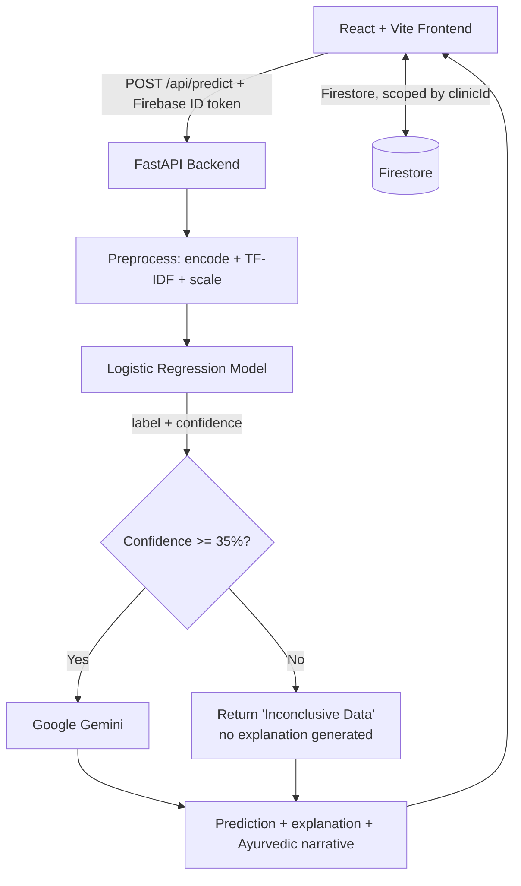

# ArogyaAI — Mentor Demo Guide 🌿

Every statement below is checked against the code in this repository. Where a
number is quoted, it comes from `ml/artifacts/metrics.json` or a live run.

## 1. Project Elevator Pitch (what to say first)

> **"ArogyaAI is a Clinical Decision Support prototype for Ayurvedic practice.
> It predicts a likely condition from a patient's symptoms and profile using a
> trained Logistic Regression model, then uses Google Gemini to generate an
> Ayurvedic explanation and care guidance for that prediction. The prediction and
> the generated explanation are shown separately, so a practitioner can always
> see which part is statistical and which is LLM prose. It is decision support —
> not a diagnostic device."**

---

## 2. Architecture (only components that actually exist)

There is **no** rule-based knowledge base, and **no** offline recommendation
database. When the LLM is unavailable, the prediction still returns and the
narrative is replaced by a plain "unavailable" message — nothing else is
substituted. See `FALLBACK_MECHANISM.md`.

### Technical stack

- **Frontend**: React 19, TypeScript, Vite 8, Tailwind CSS 3, Framer Motion, lucide-react
- **Backend**: FastAPI, Uvicorn, Pydantic v2, Python ≥ 3.11
- **Machine Learning**: scikit-learn — **Logistic Regression** (multinomial), selected by cross-validation. TF-IDF over symptom text (807 features) + 12 structured features = **819 inputs**. 399 classes.
- **Generative AI**: Google Gemini, with a 3-model fallback chain
- **Database / Auth**: Firebase Firestore + Firebase Authentication
- **Dataset**: `enhanced_ayurvedic_treatment_dataset.csv` — 4,201 rows, 399 labels

---

## 3. Measured model performance (say these, not 99%)

From `ml/artifacts/metrics.json`, on an untouched 841-row test split, produced by
the leak-free pipeline in `ml/train.py`:

| Metric | Value |
|---|---|
| Accuracy | **0.8859** |
| Macro F1 | **0.8372** |
| Weighted F1 | 0.8761 |

The older 99–100% figures came from a pipeline that leaked the test set into
preprocessing and model selection. They are withdrawn and must not be repeated.
Full detail: `MODEL_CARD.md`.

---

## 4. Live Demonstration Script

### Step 1 — Authentication

1. Open the app.
2. Point out the role selector (patient / practitioner) and the Google sign-in option.
3. **Say:** *"Registration and login are handled by Firebase Authentication;
   passwords are never stored by our code. A practitioner self-registers with a
   Clinic ID and then waits for a platform administrator to approve the account —
   Firestore rules make that approval impossible to grant from a client, so a
   pending doctor can read their own profile and nothing else."*

### Step 2 — Run a prediction (practitioner)

1. Open **Diagnose**.
2. Enter a patient and symptoms. This case scores above the 35% gate:
   - **Symptoms:** `fever, severe headache, body ache, chills, fatigue`
   - **Age:** 25 · **Height:** 175 cm · **Weight:** 70 kg
   - **Gender:** Male · **Body type (Dosha):** Pitta
   - **Season:** Monsoon · **Weather:** Hot & humid
3. Click **Analyze**.

### Step 3 — Explain the result screen

1. **ML Prediction** — the label and the confidence percentage.
   **Say:** *"This is the model's own output. The confidence is a raw
   `max(predict_proba)` — not a calibrated probability — so I report it as a
   relative score, not as a chance of being correct."*
2. **AI X-Ray / explanation panel** — the model's own per-feature contributions.
   **Say:** *"These are the actual terms from the linear model's score for the
   predicted class — computed from its coefficients, not inferred from the
   generated text."*
3. **Ayurvedic narrative** — generated by Gemini.
   **Say:** *"This part is generated prose. It is educational context for the
   prediction; it does not verify or improve the prediction, and it has not been
   clinically reviewed."*
4. **Disclaimer** — point out the on-screen statement that this is decision
   support and requires practitioner review.

### Step 4 — Save and review

1. **Save Record** → written to Firestore under the practitioner's `clinicId`.
2. Open **Patient Records** → the record appears, scoped to the clinic.
3. Log in as the patient → they see only their own record and their assessment
   history.

**Demo tip:** free-text symptom phrasing often scores below the 35% gate and
shows *Inconclusive Data*. That is the safety gate working — present it as a
feature. Use the vocabulary above for the positive path.

---

## 5. Likely mentor questions

| Question | Answer |
|---|---|
| **Why Logistic Regression and not Random Forest?** | Both are trained and compared by cross-validation. Logistic Regression won (CV macro-F1 0.8360 vs RF 0.7684) and is what is deployed — there is no manual override. RF is also slower and larger. |
| **What is your accuracy?** | 0.8859 accuracy, 0.8372 macro-F1, on an untouched 841-row test split. Earlier 99–100% figures were withdrawn as leakage-affected. |
| **How do you handle class imbalance?** | `class_weight='balanced'` in training. SMOTE is fitted on the training split only and recorded as a comparison variant, not used for the deployed model. |
| **What happens if the LLM fails?** | The prediction still returns. Only the narrative degrades — to a plain "temporarily unavailable" message. There is no knowledge-base fallback; it does not exist. |
| **Is `/api/predict` authenticated?** | Yes — it requires a Firebase ID token and returns 401 without one. It is also rate-limited per caller (30/min by default, 429 with `Retry-After`). |
| **How are Doshas used?** | The recorded constitution is one encoded input feature. It influences the prediction and is passed to the LLM as context; it is not a lookup key into an herb table. |
| **How many conditions?** | 399 labels. |
| **Does it diagnose?** | No. It suggests a likely condition with a confidence, for a practitioner to review. It is not clinically validated. |

---

## 6. Honest limitations (know these before you are asked)

1. The dataset has no clinical provenance and contains label synonyms the model
   cannot separate, which caps achievable accuracy.
2. Confidence is uncalibrated — no Platt scaling or isotonic regression.
3. The 35% gate is an inherited safety heuristic, not a statistically derived cut-off.
4. The rate limiter is per-process; scaling out multiplies the effective limit.
5. Ayurvedic guidance is LLM-generated, not curated, and is not persisted.
6. No OCR, no medical-report upload, no multi-tenancy beyond the clinic ID.
