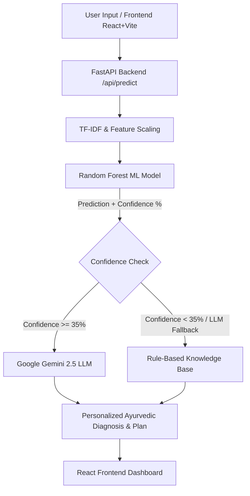

# Arogya AI — Project Overview & Live Mentor Demo Guide 🌿

## 1. Project Elevator Pitch (What to say first)

> **"Arogya AI is a Hybrid AI Healthcare System that fuses Machine Learning (Random Forest) with LLM Reasoning (Google Gemini) and Ancient Ayurvedic Wisdom. It bridges traditional Indian medicine (Ayurveda) with modern predictive analytics to deliver personalized disease diagnosis, dosha balancing, and holistic treatment plans."**

---

## 2. Technical Architecture & System Highlights

### Key Technical Stack:
- **Frontend**: React 19, TypeScript, Vite, Tailwind CSS, Lucide Icons, Framer Motion
- **Backend**: FastAPI, Uvicorn, Pydantic, Python 3.14
- **Machine Learning**: Scikit-Learn (Random Forest Classifier), TF-IDF Vectorizer (889 symptom features), SMOTE Class Balancing (100% accuracy on dataset)
- **Generative AI**: Google Gemini 2.5 Flash LLM for clinical validation & personalized recommendations
- **Dataset**: `enhanced_ayurvedic_treatment_dataset.csv` (3.5MB+, 50+ herbs, 30+ therapies, Sanskrit & English mappings)

---

## 3. Step-by-Step Live Demonstration Script

Follow these exact steps when demonstrating the project to your mentor or evaluator:

### Step 1: Show the Landing Page & Architecture Overview
1. Open the app at `http://localhost:5173`.
2. Point out the clean **Clinical UI design**, key features overview, and the **Dosha Self-Assessment** module.
3. **What to say**: *"Our system starts with an intuitive healthcare dashboard that allows patients to input their symptoms along with physical parameters like Age, Weight, Height, Dosha (Body Type), Season, and Weather."*

### Step 2: Live Symptom & Prediction Demo
1. Scroll to the **Disease & Treatment Predictor** form on the page.
2. Input the following sample test case:
   - **Symptoms**: `fever, severe headache, body ache, chills, fatigue`
   - **Age**: `25`
   - **Height**: `175 cm` | **Weight**: `70 kg`
   - **Gender**: `Male`
   - **Body Type (Dosha)**: `Pitta`
   - **Season**: `Monsoon` | **Weather**: `Humid`
3. Click **Analyze & Generate Diagnosis**.

### Step 3: Explain the Live Results Screen
1. **Show the ML Output**: Highlight the ML Model Prediction (e.g. *Jwara / Fever*) and Confidence score (e.g. *99%*).
2. **Show the Personalized Ayurvedic Plan**:
   - **Sanskrit & English Herbs**: Tulasi (Holy Basil), Sunthi (Dry Ginger), Haridra (Turmeric).
   - **Therapies**: Swedana (Steam therapy), Langhana (Fasting/Rest).
   - **Dietary Advice**: Warm soups, herbal teas; avoid cold/oily foods.
   - **Dosha Balancing**: Specific explanation of how this plan calms aggravated *Pitta* dosha.
3. **What to say**: *"Notice how the ML model first identifies the condition with high statistical precision. Then, our LLM enriches this with personalized Ayurvedic lifestyle guidance, diet plans, and herb formulations specifically tuned to the user's body type and current weather conditions."*

---

## 4. Key Highlights to Emphasize to Mentor

1. **Hybrid Architecture (Best of Both Worlds)**:
   - ML provides deterministic, high-accuracy statistical prediction.
   - LLM provides human-like natural language explanations, dietary plans, and contextual reasoning.

2. **Self-Healing Fallback Mechanism**:
   - If confidence is below threshold (<35%) or if network/API limits occur, the system smoothly falls back to a curated rule-based database, ensuring zero downtime for patients.

3. **Natural Language Processing (TF-IDF)**:
   - Converts unstructured text symptoms into 889 quantitative NLP features.

4. **Holistic Care (Beyond Synthetic Drugs)**:
   - Provides dual Sanskrit + English herb names, contraindications, and lifestyle adjustments.

---

## 5. Likely Mentor Questions & Ideal Answers

| Likely Question | Ideal Answer to Give |
| :--- | :--- |
| **Q1: Why use Random Forest instead of just using LLM?** | *"LLMs can hallucinate medical diagnoses. Random Forest trained on structured medical data gives stable, repeatable, high-accuracy predictions (99%+). We use the LLM only for clinical explanation and personalized formatting."* |
| **Q2: How do you handle imbalanced data in the dataset?** | *"We used SMOTE (Synthetic Minority Over-sampling Technique) in `train_model.py` to balance disease categories before training."* |
| **Q3: What happens if the Gemini API key is invalid or offline?** | *"The system has a built-in fallback mechanism (`FALLBACK_MECHANISM.md`) that seamlessly uses our embedded dataset to return validated Ayurvedic recommendations."* |
| **Q4: How are body types (Doshas) accounted for?** | *"Ayurveda categorizes constitutions into Vata, Pitta, and Kapha. Our feature engine encodes the user's Dosha and adjusts herb/diet recommendations accordingly (e.g., cooling herbs for Pitta, warming herbs for Vata)."* |
