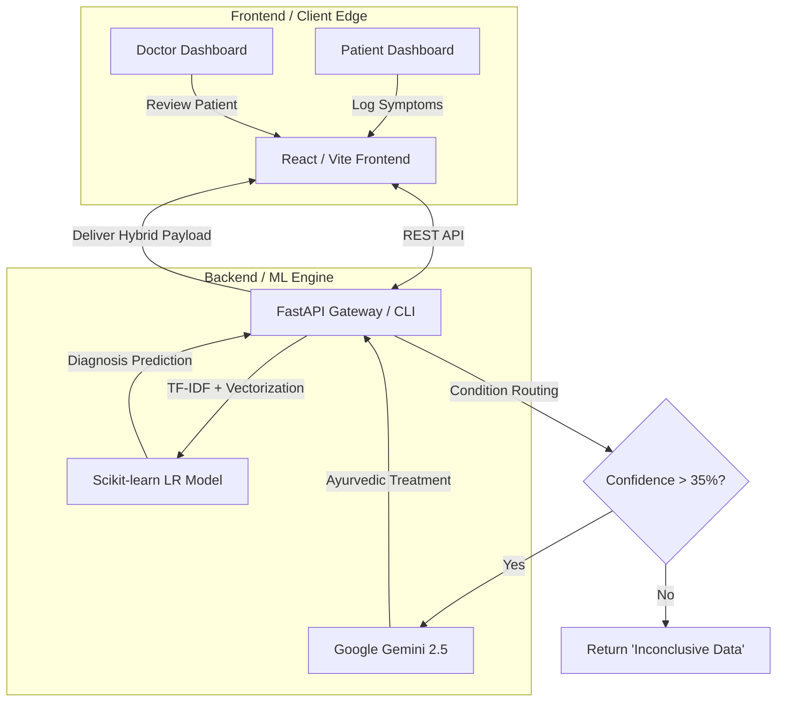

# 🌿 Arogya AI – Disease Prediction System with Ayurvedic Intelligence


ArogyaAI is a Clinical Decision Support prototype that combines a trained
machine-learning model with a generative-AI layer to assist Ayurvedic
practitioners. It suggests a likely condition from symptoms and a patient
profile, then produces an educational Ayurvedic context for that suggestion.

**It is not a diagnostic device.** Predictions are probabilistic, may be wrong,
and are presented as decision support only — never as a medical diagnosis, and
never as a substitute for a qualified practitioner.

By using a **Dual-Engine architecture** (a deterministic ML model plus Gemini for
contextual explanation) with role-based access control enforced in Firestore
security rules, ArogyaAI keeps clinical records scoped to a clinic and to the
patient they describe.

https://github.com/user-attachments/assets/71080ee0-c7ad-4143-b0fb-4fe6cfd9c607

---

## 🎯 The Problem & Solution
Traditional Ayurvedic diagnostics rely heavily on practitioner intuition, while modern medical AI models act as "black boxes" that ignore holistic factors like Doshas (Prakriti) and seasonality. Exposing raw, low-confidence ML predictions directly to patients poses a severe psychological risk.

**ArogyaAI addresses this by:**
1. Combining a Logistic Regression prediction with a generative-AI layer that
   supplies Ayurvedic context for it. The model's measured performance is
   documented honestly in `MODEL_CARD.md`; no accuracy figure is asserted here.
2. Keeping the prediction and the AI explanation visibly separate, so a
   practitioner can see which part is statistical and which is generated prose.
   The prediction is accompanied by the model's own per-feature contributions
   (the "AI X-Ray" panel), computed from its coefficients, not inferred from the
   generated text.
3. Applying a confidence gate: below 35% the system returns "Inconclusive Data"
   and does not name a condition or generate a care plan.

---


## 🚀 System Architecture & Flow



---

## ✨ Key Features & Model Performance

### 🧠 Dual-Engine AI

* **Logistic Regression classifier** over a dataset of 4,201 records spanning 399
  disease labels, using 12 structured features plus a TF-IDF vector of the
  symptom text. Random Forest is trained as a comparison candidate and is not
  deployed — it lost cross-validation.
* **Class imbalance:** 399 classes over 4,201 rows means many labels have only a
  handful of examples. Training handles this with `class_weight='balanced'`,
  which adjusts the loss without synthesising data. SMOTE is fitted and scored on
  the training split as a documented comparison variant, but is not the deployed
  path: on classes this sparse it is mathematically unsafe inside CV.
  Accuracy figures previously published in this README (99–100%) came from a
  pipeline that fitted preprocessing and SMOTE **before** the train/test split
  and selected the model **on the test set**. That is data leakage and those
  numbers are withdrawn. Corrected, reproducible metrics are in `MODEL_CARD.md`.
* **Gemini** generates the Ayurvedic contextual explanation. It receives the ML
  prediction and confidence as **inputs** and does not compute its own.

### 🌿 Ayurvedic Intelligence
* **Comprehensive Dosha Selection:** Detailed assessment supporting Vata, Pitta, Kapha, and mixed body constitutions.
* **Granular Treatment Plans:** Provides Sanskrit and English herb names, precise dietary recommendations, and Ayurvedic therapies (Abhyanga, Nasya, Panchakarma).

### 🔐 Full-Stack Web Platform
* **Role-Based Portals:** Secure Practitioner and Patient views with Clinic ID siloing.
* **Safety Guardrails:** A prediction is withheld as "Inconclusive Data" below 35% confidence instead of being presented as a finding. Below that threshold the stored record is also relabelled neutrally, so patient history never shows an unreliable guess as a condition.

---

## ⚙️ How to Run & Use the System

You can run ArogyaAI in two distinct modes: **Web Mode** (for full UI/UX) or **CLI Mode** (offline, terminal testing).

### 1. Initial Setup (Required for both modes)
```bash
git clone https://github.com/gohilnil/ArogyaAI-Clinical-Decision-Support.git
cd ArogyaAI-Clinical-Decision-Support
pip install -r requirements.txt
```
*(Optional)* Train the model if `arogyaai_model.joblib` is missing:
```bash
python train_model.py
```

### 💻 Mode A: Web Interface (Full-Stack)
Run the modern React + FastAPI ecosystem.

**Start the Backend (FastAPI):**
```bash
uvicorn backend.index:app --reload
# Runs on http://127.0.0.1:8000
```
**Start the Frontend (React):**
Open a new terminal:
```bash
cd frontend
npm install
npm run dev
# Runs on http://localhost:5173
```

### 🖥️ Mode B: CLI Assessment (Terminal)
For developers or offline scenarios wanting to talk directly to the model.
```bash
python arogya_predict.py
```
*Follow the interactive prompts to enter symptoms (e.g., "joint pain, morning stiffness"), age, dosha, etc., and get a brilliant console printout of your predicted disease and Ayurvedic protocol.*

---

## 🌐 Deployment

The full runbook — exact commands, required secrets, and the steps that need a
human — is in [DEPLOYMENT.md](DEPLOYMENT.md). Summary:

The service is split because the Python backend needs a persistent process with
a real filesystem (it loads a scikit-learn artifact at startup), which serverless
hosting does not provide comfortably:

1. **Frontend (Vercel):** the `frontend/` directory, built with `npm run build`.
   Set `VITE_API_URL` to the backend origin.
2. **Backend (Render):** the FastAPI app, driven by `render.yaml`. Serves
   `uvicorn backend.index:app`.

**Deployment status: UNVERIFIED.** No credentials for Render, Vercel or the
Firebase project were available in the environment where this work was done, so
nothing has been deployed or re-deployed by it. Everything below has been
verified locally; the external steps are documented, not claimed.

---

## Key Features

  **Machine-Learning Prediction**: Logistic Regression over 12 structured features plus a TF-IDF vector of the symptom text  
 **TF-IDF Symptom Analysis**: Converts free-text symptoms into numeric features using natural language processing  
 **Class Imbalance Handling**: `class_weight='balanced'` in training; SMOTE is fitted and scored as a documented comparison variant (see `MODEL_CARD.md`)  
 **Ayurvedic Context**: Educational dietary, lifestyle, and precaution guidance alongside the prediction  
 **Personalized Body Type (Dosha) Recommendations**: Context adjusts to the recorded constitution  
 **Interactive Assessment Mode**: Step-by-step symptom and health data collection  
 **Integrated ML + LLM System**: The ML model owns the prediction and confidence; Gemini supplies the Ayurvedic explanation  
 **Confidence Gate**: Predictions below 35% confidence are withheld and reported as inconclusive  
 **Patient Records & History**: One stable record per patient, with each visit stored as a separate assessment  
 **Role-Based Access**: Separate practitioner and patient portals, enforced by Firestore security rules  
 **Append-Only Clinical History**: Assessments and symptom diary entries cannot be edited or deleted from a client

## What You Get from Predictions

Each prediction provides all the requested fields:

- **Ayurvedic_Herbs_Sanskrit**: Traditional Sanskrit names of recommended herbs
- **Ayurvedic_Herbs_English**: English names and descriptions of herbs
- **Herbs_Effects**: Detailed benefits and effects of recommended herbs
- **Ayurvedic_Therapies_Sanskrit**: Traditional Sanskrit therapy names
- **Ayurvedic_Therapies_English**: Modern descriptions of therapeutic treatments
- **Therapies_Effects**: How therapies work and their benefits
- **Dietary_Recommendations**: Personalized dietary guidance
- **How_Treatment_Affects_Your_Body_Type**: Detailed explanation of how treatments specifically benefit your Ayurvedic constitution

## Quick Start

### 1. Install Dependencies
```bash
pip install -r requirements.txt
```

### 2. Train the Model (if needed)
```bash
python train_model.py
```
This creates `arogyaai_model.joblib` with all necessary components.

### 3. Run the Model
```bash
python arogya_predict.py
```

### 4. Interactive Mode
For personalized assessment, run the script and choose interactive mode when prompted:
```bash
python arogya_predict.py
```


## Enhanced Features

### 🌿 Comprehensive Dosha Selection
The system now includes a detailed Ayurvedic body type assessment with 6 constitution types:
- **Vata** (Air_Space_Constitution) - Thin/Lean: Naturally thin build, difficulty gaining weight, dry skin, cold hands/feet
- **Pitta** (Fire_Water_Constitution) - Medium: Medium build, good muscle tone, warm body, strong appetite  
- **Kapha** (Earth_Water_Constitution) - Heavy/Large: Naturally larger build, gains weight easily, cool moist skin, steady energy
- **Vata-Pitta** (Air_Fire_Mixed_Constitution) - Thin to Medium: Variable build, creative energy, moderate body temperature
- **Vata-Kapha** (Air_Earth_Mixed_Constitution) - Thin to Heavy: Variable patterns, irregular tendencies, sensitive to changes
- **Pitta-Kapha** (Fire_Earth_Mixed_Constitution) - Medium to Heavy: Strong stable build, good strength, balanced metabolism

### 📊 Confidence Scoring
The reported confidence is the Logistic Regression model's own class probability for the
predicted label (`max(predict_proba)`), expressed as a percentage. It is a raw
model probability, **not** a calibrated one: no probability-calibration step
(Platt scaling, isotonic regression) has been applied. Where the model is
over-confident, the number will be too. Calibration is listed as future work.

Predictions below 35% are withheld and reported as "Inconclusive Data". That
threshold is a safety choice, not a statistically derived cut-off.

### 🤖 Integrated ML + LLM Analysis
Two stages run in order. The model produces the prediction and the confidence —
that part is statistical and reproducible. Gemini then generates an Ayurvedic
narrative for that prediction, written from the patient's profile and symptom
text. The narrative is generated prose: it adds context and educational
guidance, but it does **not** verify, correct or improve the prediction, and it
is not a diagnosis. Both stages are shown separately in the UI so a practitioner
can see which part is which.

## Sample Output

```
============================================================
AROGYA AI - Integrated ML + LLM Prediction System
============================================================
Please provide your details to receive a personalized analysis.
------------------------------------------------------------
Enter your symptoms (comma-separated): joint pain, stiffness, swelling, difficulty walking, morning stiffness
Enter your age: 52
Enter your height (cm): 168
Enter your weight (kg): 78
Enter your gender: Female
Enter your general body type (e.g., Thin, Medium, Heavy): Medium
Enter your food habits (e.g., Vegetarian, Non-Vegetarian, Mixed): Vegetarian
Enter your current medication (if any, otherwise type 'None'): None
Enter any allergies (if any, otherwise type 'None'): None
Enter the current season (e.g., Summer, Monsoon, Winter): Winter
Enter the current weather (e.g., Hot, Humid, Cold): Cold

Analyzing your information...
   => ML Model Prediction: 'Arthritis' (Confidence: 96.50%)

============================================================
🌿 Arogya AI - Personalized Ayurvedic Analysis 🌿
============================================================
💖 Your Ayurvedic Diagnosis

Predicted Disease: Arthritis (Sandhivata) [Confidence Level: 97%]

Based on your profile and symptoms, you are experiencing Arthritis (Sandhivata in Ayurveda), 
primarily caused by Vata dosha aggravation. The combination of joint pain, stiffness, swelling, 
difficulty walking, and morning stiffness are classic symptoms of this condition, especially 
prevalent during cold weather which naturally aggravates Vata.

🌿 Your Personalized Ayurvedic Plan

🩺 Condition Explained
Sandhivata (Arthritis) occurs when Vata dosha accumulates in the joints (Sandhi), causing 
pain, stiffness, and inflammation. The cold, dry qualities of Vata are particularly aggravated 
during winter, leading to reduced flexibility and increased discomfort. Ama (toxins) may also 
accumulate in the joints, further worsening the condition.

Ayurvedic Medicinal Herbs
- Sanskrit: Shallaki, Guggulu, Ashwagandha, Nirgundi
- English: Boswellia, Indian Bdellium, Winter Cherry, Vitex
- Effects: Anti-inflammatory, reduces joint pain, strengthens bones and tissues, improves 
  mobility, reduces Vata aggravation

💆 Ayurvedic Therapies
- Sanskrit: Abhyanga, Pinda Sweda, Janu Basti, Swedana
- English: Warm oil massage, Herbal bolus therapy, Knee pooling therapy, Steam therapy
- Effects: Lubricates joints, reduces stiffness, improves circulation, removes toxins, 
  alleviates pain, nourishes tissues

🥗 Dietary Recommendations

Eat This:
- Warm, cooked, and easily digestible foods
- Ghee, sesame oil, and healthy fats
- Ginger, turmeric, and warming spices
- Cooked vegetables like carrots, sweet potatoes, and squash
- Warm milk with turmeric before bed
- Moong dal and whole grains like rice and wheat

Avoid This:
- Cold, raw, and frozen foods
- Excess sour, salty foods (can increase inflammation)
- Refined sugars and processed foods
- Nightshade vegetables (tomatoes, potatoes, eggplant) which may aggravate inflammation
- Heavy, oily, and deep-fried foods

🏃 Lifestyle Advice
- Practice gentle yoga and stretching exercises daily to maintain flexibility
- Keep joints warm, especially during cold weather
- Apply warm sesame oil massage to affected joints before bathing
- Maintain regular sleep schedule (sleep before 10 PM, wake before 6 AM)
- Stay active but avoid overexertion
- Practice stress management through meditation and pranayama

🌿 Home Remedies & Precautions
- Drink warm water with ginger throughout the day
- Apply warm sesame or castor oil to painful joints
- Use heating pads or warm compresses on affected areas
- Take turmeric milk (1 tsp turmeric in warm milk) before bed
- Gentle massage with warm oils improves circulation
- Epsom salt bath can provide relief

👤 How Treatment Affects Your Body Type
These Ayurvedic treatments specifically address Vata imbalance by providing warmth, 
lubrication, and nourishment to your joints. The warm, oily therapies counteract the 
cold, dry nature of aggravated Vata, helping restore balance and mobility. Regular 
practice will strengthen your tissues, reduce inflammation, and improve overall joint health.

⚠️ Important Note: This is a complementary Ayurvedic approach. For severe arthritis, 
persistent pain, or worsening symptoms, please consult with a qualified healthcare 
professional or rheumatologist for comprehensive medical evaluation and treatment.

---
💡 This analysis combines ML prediction (96.50% confidence) with traditional Ayurvedic 
wisdom to provide personalized recommendations based on your unique constitution and symptoms.
```

## System Architecture

1. **Data Processing**: TF-IDF vectorization of symptoms (807 features, measured
   from the persisted vectorizer)
2. **Feature Engineering**: 12 structured features + 807 TF-IDF features = 819
   model inputs
3. **Class Balancing**: `class_weight='balanced'` (SMOTE is evaluated as a
   comparison variant only — see the caveat under Model Performance)
4. **Model Training**: Random Forest and Logistic Regression are trained and
   compared by cross-validation; the CV winner is persisted
5. **ML Prediction**: The trained model returns a label and a class probability
6. **AI Analysis**: Gemini generates Ayurvedic context for the prediction
7. **Confidence Gate**: Below 35% the prediction is withheld as inconclusive

## Model Performance

> **The accuracy figures previously listed here (100% / 99.64% / 94.17%) are
> withdrawn.** They came from a pipeline that (a) fitted the TF-IDF vectorizer
> and scaler on the full dataset before splitting, (b) applied SMOTE before the
> split, and (c) selected the winning model using the test set. Each is data
> leakage, so the numbers do not estimate generalisation performance.

Verified facts about the current artifact:

- **Model**: Logistic Regression (`LogisticRegression`), 399 classes — selected
  by cross-validation, not chosen by hand
- **Feature set**: 819 inputs (12 structured + 807 TF-IDF)
- **Dataset**: 4,201 records across 399 labels — heavily imbalanced, with the
  smallest classes holding only 3 examples each
- **Artifact version**: `v3-cv-selected`

Corrected metrics, produced by a leak-free pipeline (`ml/train.py`: split first,
fit preprocessing on the training split only, select by cross-validation on the
training split, evaluate once on an untouched test set):

| Metric | Value |
|---|---|
| Accuracy | **0.8859** |
| Macro F1 | **0.8372** |
| Weighted F1 | 0.8761 |

The gap between weighted and macro F1 reflects the class imbalance. The full
metric set, per-class report, confusion matrix and error analysis are in
[`MODEL_CARD.md`](MODEL_CARD.md). Reproduce with:

```bash
python ml/train.py
python ml/evaluate.py
```

---

## 📈 Detailed System Architecture & Performance

### End-to-End Pipeline
1. **Data Processing**: TF-IDF vectorization of symptoms (807 features)
2. **Feature Engineering**: 12 structured features + 807 TF-IDF features = 819 inputs
3. **Class Balancing**: `class_weight='balanced'` in training, with a SMOTE
   variant fitted on the training split and recorded for comparison
4. **Model Training**: stratified split → train-only preprocessing → cross-validated
   selection → one evaluation on the untouched test set
5. **AI Analysis**: Gemini generates Ayurvedic context for the prediction

### Model Accuracy

Measured on an untouched 841-row test split by the pipeline in `ml/train.py`:

- **Logistic Regression (deployed)**: 0.8859 accuracy / 0.8372 macro-F1
- **Random Forest (candidate)**: 0.8502 accuracy / 0.7946 macro-F1

The deployed model is whichever wins cross-validation — there is no manual
override. The older figures (100% / 99.64% / 94.17%) were produced by a leaking
pipeline and are retracted. See [`MODEL_CARD.md`](MODEL_CARD.md) for the full
metric set and [`PHASE_5_MODEL_DECISION.md`](PHASE_5_MODEL_DECISION.md) for the
selection evidence.

---

## 🔬 Supported Condition Labels (399)

The model predicts one of 399 condition labels. These are dataset labels, not
validated clinical categories, and the model's measured performance is documented
in [`MODEL_CARD.md`](MODEL_CARD.md) — accuracy is well below perfection and 94 of
841 test rows are misclassified. The label set spans categories such as:

- **Infectious Diseases:** Dengue, Tuberculosis, Malaria, Hepatitis
- **Metabolic & Endocrine:** Diabetes, Hypertension, Thyroid, PCOS
- **Cardiovascular & Digestive:** Stroke, Heart Disease, Gastroenteritis, Peptic Ulcers
- **Neurological & Mental Health:** Migraine, Depression, Insomnia, Epilepsy
- **Musculoskeletal:** Arthritis, Spondylosis, Osteoporosis
- **Chronic Pain Syndromes**

---

*👨‍💻 **Academic Integrity:** ArogyaAI is a prototype Clinical Decision Support System exhibiting full-stack engineering logic, robust backend integrations, and modern AI implementations. It is designed stringently to assist, not replace, licensed medical professionals.*

Ayurvedic guidance is generated by Gemini for the predicted label — it is not a
pre-written treatment plan per condition, and its quality is not clinically
assessed. See [Ayurvedic Guidance](#ayurvedic-guidance-where-it-actually-comes-from).

## Usage Modes

### 1. Demo Mode (Default)
Runs sample predictions with pre-defined test cases demonstrating the system capabilities.

### 2. Interactive Mode
Collects user symptoms and health information through an intuitive questionnaire:
- Symptoms input
- Age, height, weight
- Gender and age group
- Enhanced dosha selection with detailed descriptions
- Lifestyle factors (food habits, medication, allergies)
- Environmental factors (season, weather)

### 3. API Integration (Ready)
The system is designed to be easily integrated into web applications or APIs.

### 4. Behaviour when the LLM is unavailable

The ML prediction does not depend on Gemini, so it still runs when the AI service
is unreachable. What happens then is limited and is stated exactly:

- the predicted label and its confidence are still returned;
- the Ayurvedic explanation is **not** generated — the API returns a plain
  message saying the explanation is temporarily unavailable;
- **there is no offline Ayurvedic knowledge base.** An earlier version of this
  README and `FALLBACK_MECHANISM.md` described `load_ayurvedic_database()` and
  `get_fallback_recommendations()`; neither function exists in the codebase. That
  claim is retracted.


## Technical Implementation

- **ML Framework**: Scikit-learn
- **Text Processing**: TF-IDF Vectorization
- **Class Balancing**: `class_weight='balanced'` (SMOTE evaluated as a variant)
- **Feature Scaling**: StandardScaler
- **Model Persistence**: Joblib
- **Data Processing**: Pandas, NumPy
- **Confidence**: raw `max(predict_proba)` — **not calibrated** (see §Confidence Scoring)

## File Structure

```
├── backend/                 # FastAPI service (routes, services, ML, AI, schemas)
├── frontend/                # React + TypeScript client
├── ml/                      # Leak-free training pipeline and recorded metrics
│   ├── train.py             #   the training pipeline
│   ├── evaluate.py          #   scores a persisted artifact
│   └── artifacts/           #   metrics.json, model_metadata.json, confusion_matrix.json
├── tests/                   # Python suites + Firestore rules tests
├── train_model.py           # Thin entry point delegating to ml/train.py
├── arogya_predict.py        # Interactive CLI (same model and preprocessing)
├── requirements.txt         # Python dependencies
├── arogyaai_model.joblib    # Trained model artifact (tracked)
├── enhanced_ayurvedic_treatment_dataset.csv  # Training data: 4,201 rows, 399 labels
├── FALLBACK_MECHANISM.md    # What degrades when the LLM is unavailable
├── MODEL_CARD.md            # Methodology, metrics, limitations
└── AyurCore.ipynb           # Original research notebook (historical)
```

> Removed in the Phase 18 cleanup: `demo.py` (imported a class that never
> existed — it raised `ImportError` when run), `disease_prediction_system.py`
> (dead, referenced by nothing), `test_disease_prediction.py` (mocked every
> dependency and asserted nothing real), `README.tmp.md` and `templates/index.html`
> (unused scratch). All remain recoverable from git history.

## Ayurvedic Guidance: Where It Actually Comes From

An earlier version of this README described an "enhanced Ayurvedic knowledge
base" — a searchable database of 50+ herbs and 30+ therapies that the system
would look up at runtime. **No such component exists.** There is no herb
database, no disease-to-treatment map and no offline recommendation lookup in
this codebase; searching for one returns nothing.

What actually happens: the Ayurvedic guidance is **generated by Gemini** from
the prediction and the patient's profile, and returned as free text. The
dataset's treatment columns (`Ayurvedic_Herbs_Sanskrit`, `Therapies_Effects`,
`Dietary_Recommendations`, …) are **training data only** — they are read by the
training pipeline and are never loaded at runtime.

This means the guidance quality depends on the LLM, is not curated or validated
by a practitioner, and varies between runs. Treat it as educational context, not
as a prescription.

## Implemented

These were previously listed here as completed. Each is checked below against
what the code actually does, because several of those claims were false:

- **Web interface** — implemented (React + TypeScript client).
- **Interactive assessment mode** — implemented (the diagnostic wizard).
- **Authentication and history** — implemented (Firebase Auth; patient and
  assessment history in Firestore).
- **Dashboard for practitioners** — implemented (clinic dashboard and records).

## Future Enhancements

- **Confidence calibration** (Platt scaling / isotonic regression). Not done: the
  reported confidence is a raw model probability. Requires a calibration split.
- **Top-5 predictions.** Not implemented — the API returns a single label.
- **Integration with validated medical datasets.** Not done. The training data is
  a public Ayurvedic dataset with no clinical provenance (`MODEL_CARD.md` §2).
- Mobile application, multi-language support, telemedicine integration.

## Disclaimer

This system is for educational and research purposes. Always consult with qualified healthcare professionals for medical advice and treatment.

---

**Stay healthy with the wisdom of Ayurveda! 🌿**
